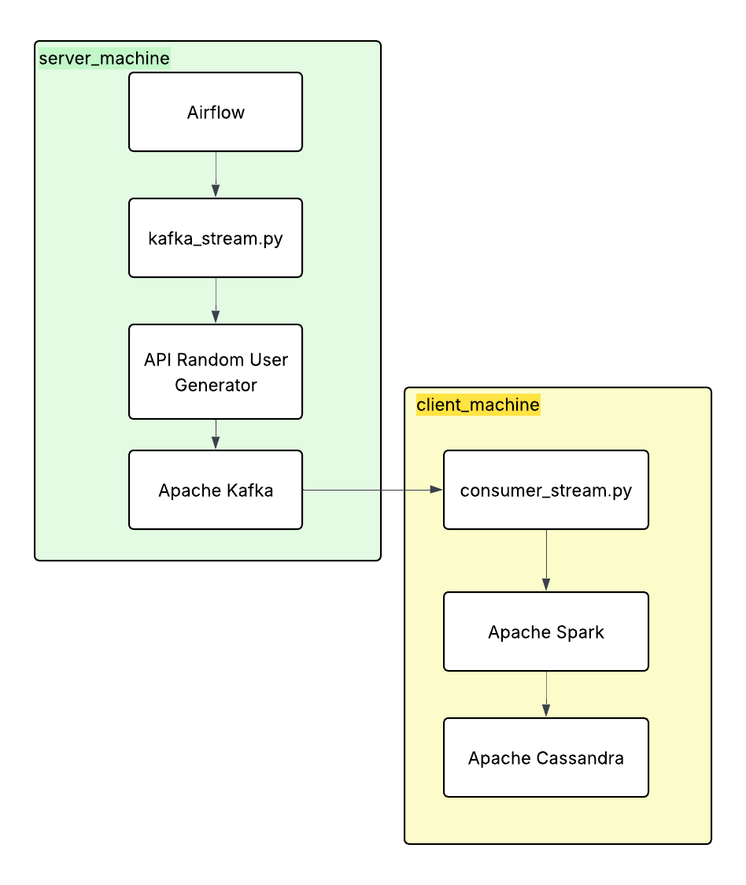

# kafka-api-data-streaming
Real-time API data streaming pipeline using Kafka, Spark, and Airflow for orchestration, with data stored in Cassandra

### Workflow

1. Airflow orchestrates the pipeline execution.
2. Data is extracted from the Random User API (https://randomuser.me/).
3. Kafka streams user records in real time.
4. Spark consumes and processes the streaming data.
5. Cassandra stores the processed records for querying and analysis.



### Run the Project

Start the server machine:

```bash
docker-compose up -d
```

Build and start the client machine:

```bash
docker build -t kafka-spark-cassandra-consumer .

docker run --name client_machine -dit \
  --network server_machine_project_1 \
  kafka-spark-cassandra-consumer
```

Start the Kafka consumer:

```bash
python consumer_stream.py --mode initial
```

Verify the data in Cassandra:

```bash
docker exec -it cassandra cqlsh

USE user_data;
SELECT * FROM tb_users;
```
